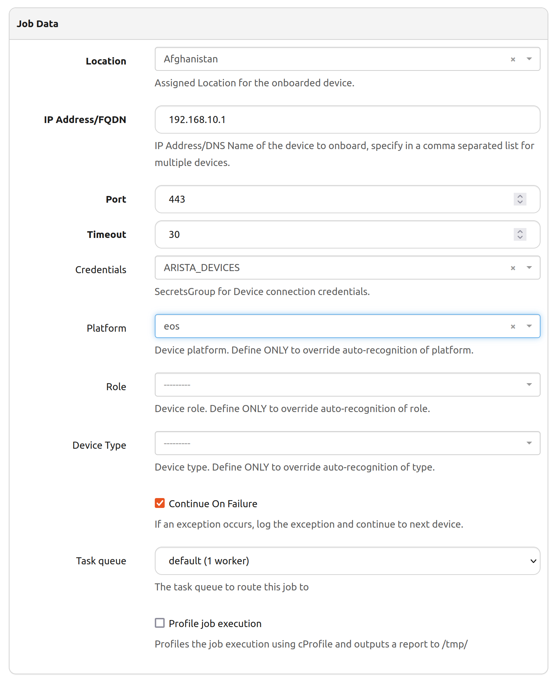

# Nautobot Device Onboarding

## Overview

Nautobot app `devices onboarding` allows pulling basic information about devices into Nautobot.
That is a very convenient way for brownfield environments to populate data directly from the network into a source of truth.

> Note: `devices onboarding` app is installed in previous tutorial.

## Setup

In the [Nautobot UI](http://localhost:8080/), navigate to `jobs` section and choose `Perform Device Onboarding`. 

At this stage, you should see an onboarding app available.

Perform new onboarding task by clicking on the blue `run` button and filling in the web form with device details that you want to get into Source of Truth(Nautobot), for example:

Required parameters to be used:
- Site: I have picked first from the list(does not really matter here)
- IP Address: `192.168.10.1` mgmt interface/IP address for device that we plan to onboard
- Port: `443` because we are using Arista VM-s connecting through eAPI
- Secrets: `ARISTA_DEVICES` secrets to be used when connecting to VM-s
- Platform: `eos` picked manually so that app can run

Job result shall look like this:

Repeat the same steps for R2 with IP Address `192.168.10.2` by clicking on `re-run` button at the top of the results.

Once completed, you should see two devices available in the Nautobot together with associated mgmt interfaces, ip addresses and prefix:

## Conclusion

Working with tools like Source of Truth means a lot of data needs to be populated into the database. `devices onboarding` app automates the initial process of getting devices into SoT.
