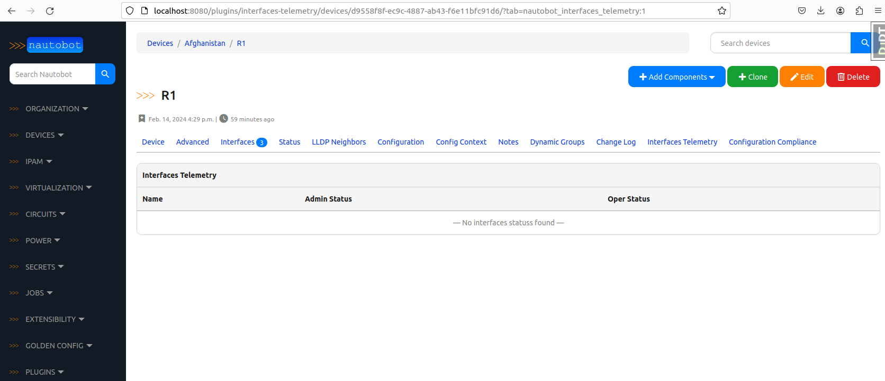

# Nautobot custom plugin installation

## Overview

In previous sections we already installed some well known Nautobot plugins like `Devices Onboarding`, `SSOT` or `Configuration Compliance` plugin.

Now let's install our own custom made plugin:
- [nautobot-plugin-interfaces-telemetry](https://github.com/mspiez/nautobot-plugin-interfaces-telemetry)

This is a crazy idea of adding a extension to the Nautobot interfaces where we could present the state of the device interfaces.

It's not common approach to keep state data in SoT systems, but let's try to do this with our custom plugin just for fun.

## Setup

Nautobot setup is described in one of the previous tutorials, but let's repeat the steps in case this is the first time you install Nautobot. 

Clone nautobot repo into the `source` directory and then copy poetry dependency files adequately:

```
$ git clone https://github.com/nautobot/nautobot.git --branch v2.1.1 source
$ cp nautobot/pyproject.toml nautobot/poetry.lock ./source
```

Make sure to setup ENV variables as such:
```
$ export NAUTOBOT_VERSION=2.1.1
$ export PYTHON_VER=3.9
```

> Note: Optionally if not done already, create Docker network that containers will be using to communicate with each other:
```
$ docker network create --driver bridge automation_net
```

Build images with `docker-compose build` command and some arguments:

```
$ docker-compose build --build-arg NAUTOBOT_VERSION="$NAUTOBOT_VERSION" --build-arg PYTHON_VER="$PYTHON_VER"
```

Start Nautobot by using `docker-compose up` command:
```
$ docker-compose up
```

At this step you can navigate to [Nautobot UI](http://localhost:8080/) and login with credentials `admin/admin`.

After logging into Nautobot you should see list of installed plugins under `Plugins` section in Nautobot UI:


Also, if you went through previous tutorials, two devices should already be available in the Nautobot.

If that is the case, navigate to one of the devices `view` and you should see additional tab there: `Interfaces Telemetry`



## Conclusion

Plugins are a very powerful feature of the Nautobot which allow for quick and easy customization.

We are going to use our custom plugin in next tutorials to present the `admin/oper` states of the interfaces.
