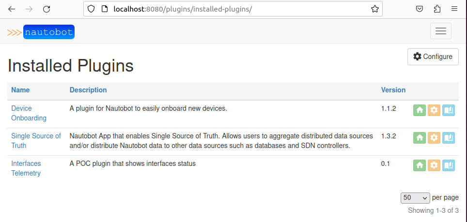

# Nautobot custom plugin installation

## Overview
-----------

In previous sections we already installed one Nautobot plugin: `Devices Onboarding`.

Now let's install following ones:
- [nautobot-plugin-ssot](https://github.com/nautobot/nautobot-plugin-ssot)
- [nautobot-plugin-interfaces-telemetry](https://github.com/mspiez/nautobot-plugin-interfaces-telemetry)

SSOT plugin is used to sync data between multiple data sources(SoT) while interfaces telemetry plugin is just extension of the configuration data in Nautobot with Interface State data that you would usually see in monitoring tools like Grafana.

## Setup
--------

Let's install new plugins and make sure they are available in Nautobot UI.

First make sure to setup ENV variables as such:
```
$ export NAUTOBOT_VERSION=1.5.22
$ export NAUTOBOT_PYTHON_VERSION=3.9
```

Next, make sure that `automation_net` is created on the local system:
```
$ docker network create --driver bridge automation_net
```

Now, docker images have to be build with `docker-compose build` command and arguments:

```
docker-compose build --build-arg NAUTOBOT_VERSION="$NAUTOBOT_VERSION" --build-arg NAUTOBOT_PYTHON_VERSION="$NAUTOBOT_PYTHON_VERSION"
```
> Note: `--no-cache` flag can be used to make sure Nautobot image is re-build.

Start Nautobot by using `docker-compose up` command:
```
$ docker-compose up
```

At this step you can navigate to Nautobot UI at `localhost:8080` and login with credentials `admin/admin`.

After loging into Nautobot you should see two additional plugins installed under `Plugins` section in Nautobot UI:



## Conclusion
-------------

Plugins are a very powerful feature of the Nautobot because they allow for customization, like new objects in the database, but also having relationships to the core objects like Devices, Interfaces, Circuits or others.
