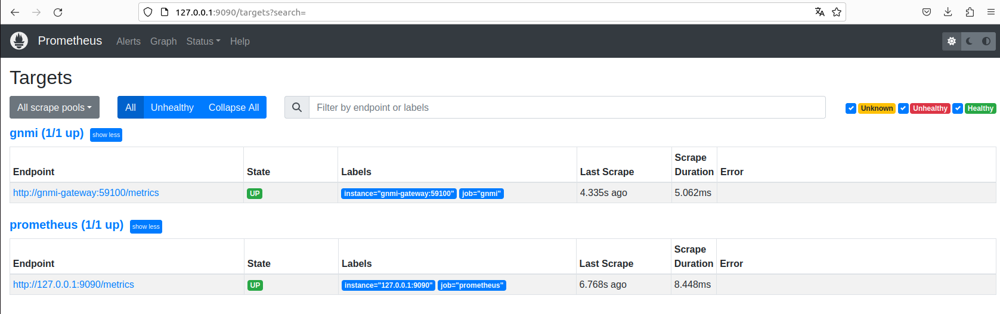
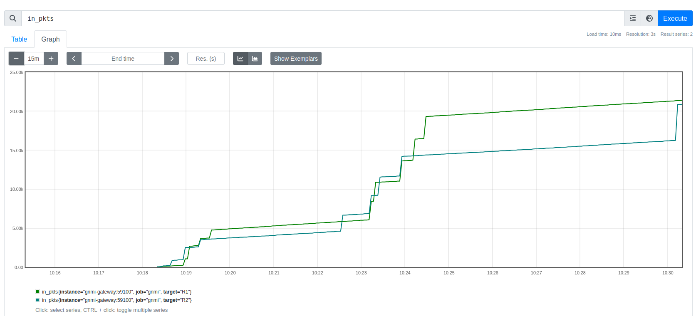

## GNMI gateway setup

More info about GNMI gateway project can be found [here](https://github.com/openconfig/gnmi-gateway)

In short: `It is a distributed and highly available service for connecting to multiple gNMI targets.`

We will set it up in way to be able to retrieve some basic metrics for the R1 and R2 devices(VM-s setup in previous tutorials).
Since we are working with a lab setup(VM-s) there will be only handful of metrics available to us.

First, lets enable GNMI on the devices.

## GNMI configuration for VM-s

Copy the following section to `R1` and `R2` devices. 
This part of the configuration is responsible for generating self signed keys and enabling GNMI.

```
conf t
security pki certificate generate self-signed cvp.crt key cvp.key generate rsa 2048 validity 30000 parameters common-name cvp
!
management api http-commands
   no shutdown
!
management api gnmi
    transport grpc GRPC
        ssl profile SELFSIGNED
    transport grpc default
!
management security
    ssl profile SELFSIGNED
        certificate cvp.crt key cvp.key
!
```

Make sure to test the configurations according to the Arista guidelines in [here](https://aristanetworks.github.io/openmgmt/examples/gnmi-clients/arista-gnmi/)

For example:
```
R1#show management api gnmi
Octa: enabled

Transport: GRPC
Enabled: yes
Server: running on port 3333, in default VRF
SSL profile: SELFSIGNED
QoS DSCP: none
Authorization required: no
Accounting requests: no
Certificate username authentication: no
Notification timestamp: last change time
Listen addresses: ::

<..>
R1#show management security ssl profile SELFSIGNED
   Profile          State    Additional Info                         
---------------- ----------- ----------------------------------------
   SELFSIGNED       valid    Certificate 'cvp.crt' hostname of this  
                             device does not match any entry of the  
                             Common Name nor Subject Alternative Name
                             in the certificate                      

R1#
```


Next let's install gNMIC on the localhost, so that we can test GNMI config on the devices
```
$ bash -c "$(curl -sL https://get-gnmic.openconfig.net)"
```

Now test the connectivity to the devices with command from the localhost:
```
$ gnmic -a R1:6030 -u admin -p admin --insecure capabilities

gNMI version: 0.7.0
supported models:
  - openconfig-platform-cpu, OpenConfig working group, 0.1.1
  - ietf-netconf-monitoring, IETF NETCONF (Network Configuration) Working Group,

<...>

```

>> Note that above check is executed against default port `6030` and not `3333`. 
However, GNMI gateway enforces [TLS usage](https://github.com/openconfig/gnmi-gateway/issues/14#issuecomment-723491395), therefore in the previous steps we have generated self singed certificates on the devices.

## gNMI Gateway build and run

Build gNMI image using `docker-compose` command:

```
$ docker-compose build
```
> Note: use `--no-cache` flag if you want to re-build the image and skip using the cached layers.

Next start the `gnmi-gateway` and `prometheus` containers:

```
$ docker-compose up
```

## Prometheus metrics

Metrics extracted from the devices(VM-s) are limited due to the fact it is just a lab environment with minimal configuration and without hardware components:

```
Fan Status  Speed  Speed Uptime Stability Uptime
--- ------ ------ ------ ------ --------- ------

% There seem to be no power supplies connected.

```

Since in [targets.json](./gnmi-gateway/targets.json) filtering is not really specified for any particular path, GNMI-gateway grabs metrics like interface packets in/out, cpu or memory utilized by the VM-s.

Before checking metrics we can verify that Prometheus targets are reachable.
In the web browser navigate to [Prometheus](http://127.0.0.1:9090/targets?search=)

At this stage under `Status/Targets` tab you should see following targets:



To check the available metrics navigate to the Prometheus `Graph` section. The ones with prefix `prometheus_` or `go_` comes from prometheus itself and you can see them [here](http://127.0.0.1:9090/metrics) - as long as the Prometheus instance is running.

All other metrics(without prefix `prometheus_` or `go_`) refers to R1 and R2 devices. Once again, this is just POC/lab so metrics visible in the Prometheus may not be accurate, but still you should see something like:




## Conclusion

This was POC of device metrics collection into Prometheus using GNMI gateway. Next, we are going to collect interface states and push it to Nautobot.
