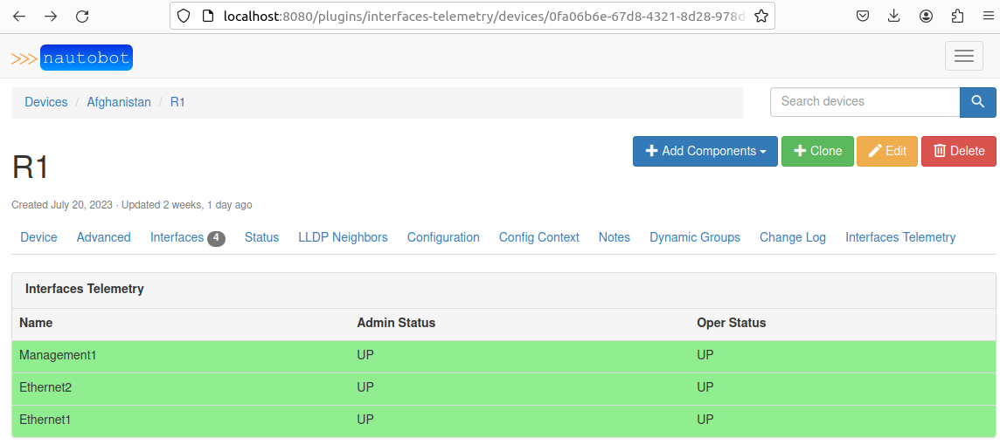
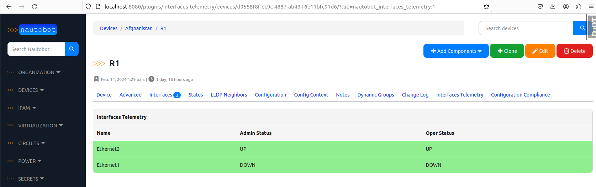
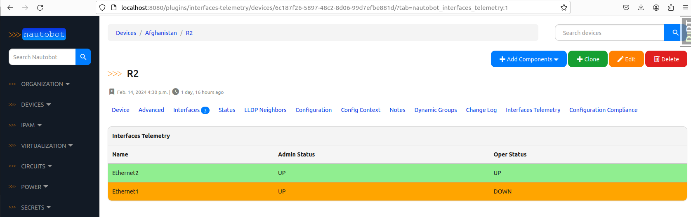

## GNMI gateway and Nautobot

More info about GNMI gateway project can be found [here](https://github.com/openconfig/gnmi-gateway)

For the purposes of this tutorial, the fork of the GNMI gateway project is used so that we can export information into Nautobot.
The goal is to get the status of the device interfaces using GNMI gateway and push it to SoT(source of truth). This way both the intended and the actual(state) data can be accessible from single place - Nautobot.

> Note that in one of the previous tutorials, we have installed custom [Nautobot plugin/APP](https://github.com/mspiez/nautobot-plugin-interfaces-telemetry) that extends Device view with interface status.


## GNMI configuration for VM-s

> Go through this step only if not completed within previous tutorial.

Copy the following section to `R1` and `R2` devices. 
This part of the configuration is responsible for generating self signed keys and enabling GNMI.

```
conf t
security pki certificate generate self-signed cvp.crt key cvp.key generate rsa 2048 validity 30000 parameters common-name cvp
!
management api http-commands
   no shutdown
!
management api gnmi
    transport grpc GRPC
        ssl profile SELFSIGNED
    transport grpc default
!
management security
    ssl profile SELFSIGNED
        certificate cvp.crt key cvp.key
!
```

Make sure to test the configurations according to the Arista guidelines in [here](https://aristanetworks.github.io/openmgmt/examples/gnmi-clients/arista-gnmi/)

For example:
```
R1#show management api gnmi
Octa: enabled

Transport: GRPC
Enabled: yes
Server: running on port 3333, in default VRF
SSL profile: SELFSIGNED
QoS DSCP: none
Authorization required: no
Accounting requests: no
Certificate username authentication: no
Notification timestamp: last change time
Listen addresses: ::

<..>
R1#show management security ssl profile SELFSIGNED
   Profile          State    Additional Info                         
---------------- ----------- ----------------------------------------
   SELFSIGNED       valid    Certificate 'cvp.crt' hostname of this  
                             device does not match any entry of the  
                             Common Name nor Subject Alternative Name
                             in the certificate                      

R1#
```


Next let's install gNMIC on the localhost, so that we can test GNMI config on the devices
```
$ bash -c "$(curl -sL https://get-gnmic.openconfig.net)"
```

Now test the connectivity to the devices with command from the localhost:
```
$ gnmic -a R1:6030 -u admin -p admin --insecure capabilities
```

> Note that above check is executed against default port `6030` and not `3333`. 
However, GNMI gateway enforces [TLS usage](https://github.com/openconfig/gnmi-gateway/issues/14#issuecomment-723491395), therefore in the previous steps we have generated self singed certificates on the devices.


## GNMI Gateway build and run

Build GNMI image using `docker-compose` command:

```
$ docker-compose build
```
> Note: use `--no-cache` flag if you want to re-build the image

Next start the `gnmi-gateway` container:

```
$ docker-compose up
```

## Interface Up/Down simulation

Depending on how you start this tutorial and R1/R2 devices, the interfaces state data in Nautobot may differ. Let's assume the starting point is that devices are already up with interfaces `UP/UP` state:



To similute interface state change event wihtin our lab, let's simply login to the device and `shutdown` interface Ethernet 1.

> Note: It can be Ethernet 1 or 2, does not really matter. Also you can `shut` and `no shut` interfaces multiple times to verify the events are being catched properly.

After shuting down the `Ethernet 1` on R1, in Nautobot under `R1 > Interfaces Telemetry` you should see interface is in Admin state `Down` and Operational state also `Down` - because it's `Down/Down`, the row is still highlighted on green:



> Note: Green color of the interface state `Down/Down` may be questionable, but let's accept it like this just for the purposes of this POC.

Finally, navigate to `R2` view, and `Interfaces Telemetry` section:



Under `R2` device view, the `Admin` state and `Oper` state does not match, therefore highlighted on Orange.


## Conclusion

This was POC of grabing device interface state using GNMI gateway and pushing that information into Nautobot where users can view it using web UI.
