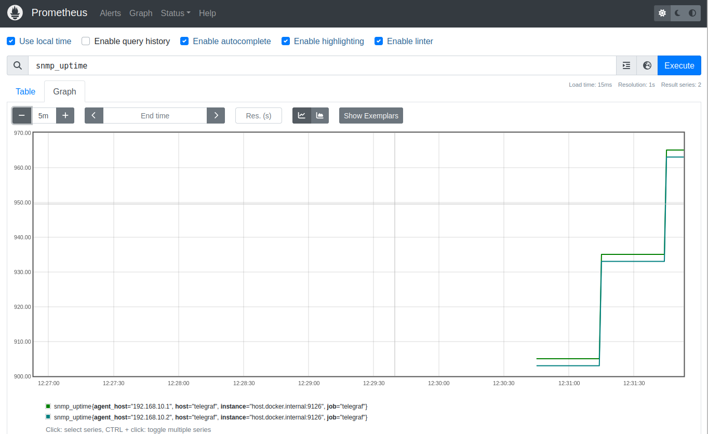

# Telgraf setup

> More info about [Telegraf](https://www.influxdata.com/time-series-platform/telegraf/)

The goal for this tutorial is to collect device `uptime` metric using Telegraf and SNMP.

## Configure SNMP v2 for R1 and R2

Configure snmp community on R1 and R2
```
snmp-server community arista ro
```

Install `snmp` cli tool on the localhost:
```
$ sudo apt install snmp
```

And execute following command from localhost:

```
$ snmpwalk -v2c -c arista 192.168.10.1
```

and

```
$ snmpwalk -v2c -c arista 192.168.10.2
```

In the output you should see device support for multiple SNMP MIB-s.

## Setup Telegraf and Prometheus

Telegraf collects devices uptime using SNMP protocol and then exposes the metrics through the `metrics` endpoint. Prometheus scraps these metrics, and they can be visible on the graphs.

Run following command to start Telegraf and Prometheus containers:

```
$ docker-compose up
```

Once containers are started you can check if Telegraf is getting metrics by inspecting logs:

```
$ docker logs telegraf
2023-07-10T22:09:00Z I! Loading config: /etc/telegraf/telegraf.conf
2023-07-10T22:09:00Z I! Starting Telegraf 1.27.1
2023-07-10T22:09:00Z I! Available plugins: 237 inputs, 9 aggregators, 28 processors, 23 parsers, 59 outputs, 4 secret-stores
2023-07-10T22:09:00Z I! Loaded inputs: snmp (2x)
2023-07-10T22:09:00Z I! Loaded aggregators: 
2023-07-10T22:09:00Z I! Loaded processors: 
2023-07-10T22:09:00Z I! Loaded secretstores: 
2023-07-10T22:09:00Z I! Loaded outputs: file prometheus_client
2023-07-10T22:09:00Z I! Tags enabled: host=telegraf
2023-07-10T22:09:00Z I! [agent] Config: Interval:30s, Quiet:false, Hostname:"telegraf", Flush Interval:10s
2023-07-10T22:09:00Z I! [outputs.prometheus_client] Listening on http://[::]:9126/metrics
snmp,agent_host=192.168.10.1,host=telegraf uptime=5372i 1689026970000000000
snmp,agent_host=192.168.10.2,host=telegraf uptime=255i 1689026970000000000

<...>
```
> Note: It can take few mins before metrics are collected

Navigate to [Prometheus](http://127.0.0.1:9090/targets?search=) and meke sure you see Telgraf target in `UP` state.

Next navigate to [Prometheus](http://127.0.0.1:9090/graph) and search for `snmp_uptime` metric like this:




> Note: You can narrow down the time frame to 5-10 mins to get better visibility on the graph


## Conclusion

This was the most basic example using Telegraf, but it is a very sophisticated tool that allows collecting metrics not only from network devices but many other systems.

