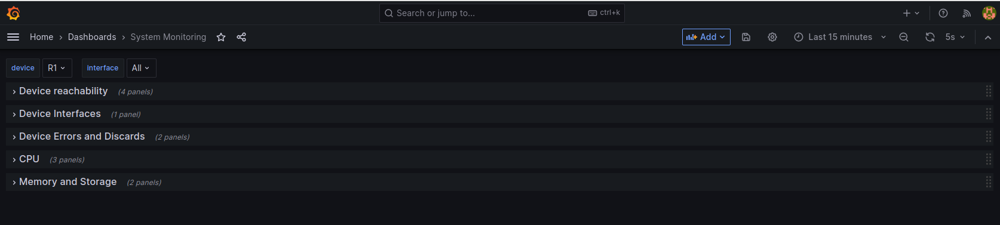
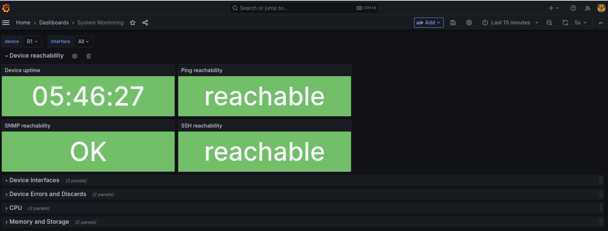
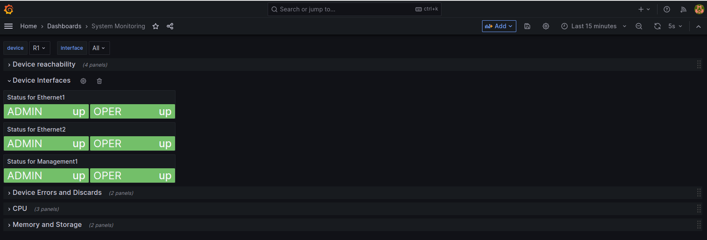
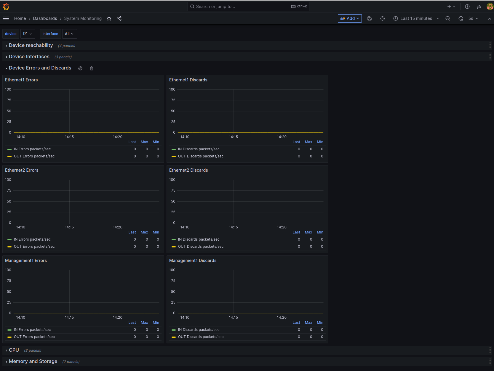
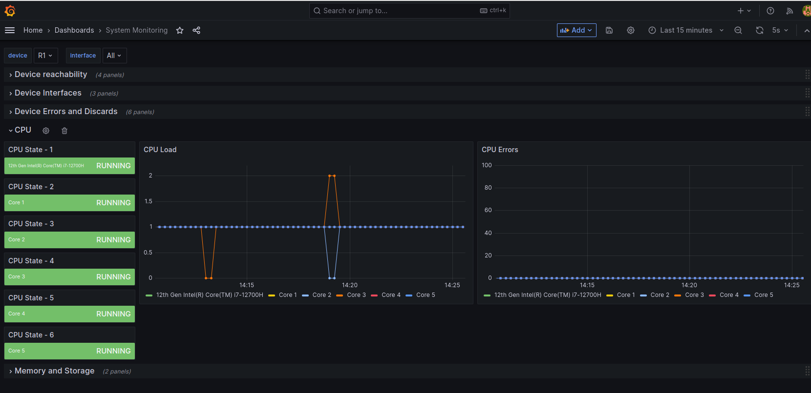
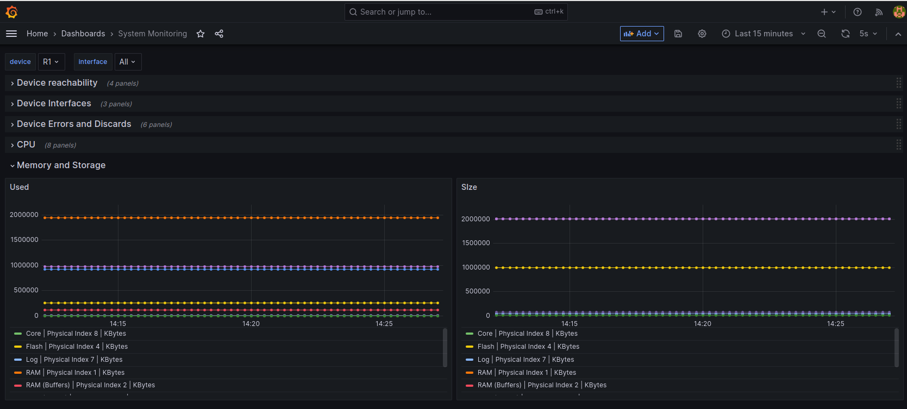

# Telgraf and Grafana

Collecting metrics using Telegraf and Prometheus is great, but without proper visualization it is not that useful.
Obviously using prometheus query language(promQL) can be used directly form Prometheus instance, but still it is much more intuitive to use Grafana UI.

In this tutorial, metrics like uptime, CPU, memory, interfaces are being collected from R1 and R2, passed to Prometheus and finally presented in Grafana UI. There is not much more work to be done then just run the following command:

```
$ docker-compose up
```

After few minutes, collected metrics should be nicely presented in the [Grafana UI](http://0.0.0.0:3000). 

> Note: Provide `admin/admin` login and password and skip the step asking for changing the password.

From Grafana home page navigate to `Home > Dashboards > System Monitoring` and you should see similar view as this one:



Try expanding the panels by clicking on each description:

`Device reachability`



`Device interfaces`



> Note: You can filter list of interfaces by picking adequate interface at the top of the dashboard.

`Device errors`



> Note: Since we are using lab setup, there are no errors or discards visible 

`CPU`



`Memory`



## Conclusion

Grafana is great tool to be used with networking metrics and definitely can help with monitoring networking devices, but also alerts visualization, troubleshooting degraded services and for sure many others.
