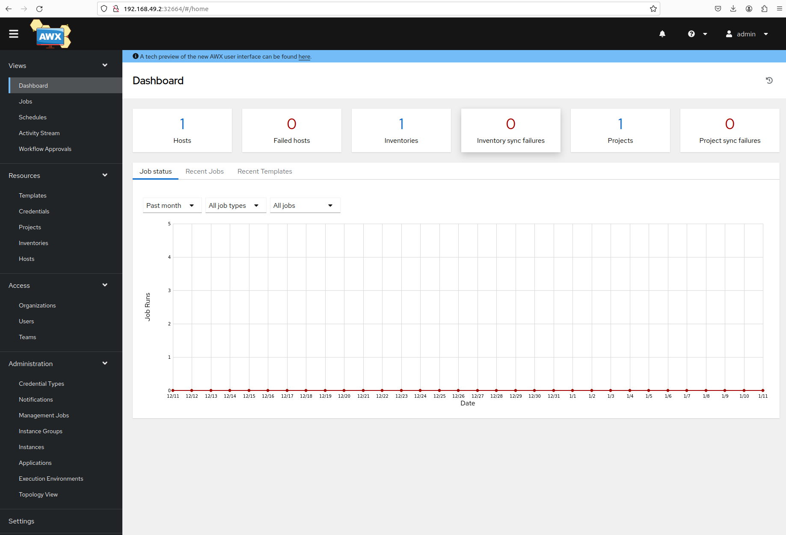

# AWX setup

Recommended way of installing AWX these days is using kubernetes. For a local environment we will use minikube.
First step will be to install `minikube` and then `AWX`.


## MINIKUBE setup

Download and install minikube on the local system:

```
$ curl -LO https://storage.googleapis.com/minikube/releases/latest/minikube-linux-amd64
$ sudo install minikube-linux-amd64 /usr/local/bin/minikube
$ rm minikube-linux-amd64
```

Start the minikube:

```
$ minikube start
😄  minikube v1.32.0 na Ubuntu 22.04
📌  Using Docker driver with root privileges
👍  Starting control plane node minikube in cluster minikube
🚜  Pulling base image ...
💾  Downloading Kubernetes v1.28.3 preload ...
    > preloaded-images-k8s-v18-v1...:  403.35 MiB / 403.35 MiB  100.00% 4.71 Mi
    > gcr.io/k8s-minikube/kicbase...:  453.90 MiB / 453.90 MiB  100.00% 2.60 Mi
🔥  Creating docker container (CPUs=2, Memory=16000MB) ...
🔗  Configuring bridge CNI (Container Networking Interface) ...
    ▪ Using image gcr.io/k8s-minikube/storage-provisioner:v5
🔎  Verifying Kubernetes components...
🌟  Enabled addons: storage-provisioner, default-storageclass
💡  kubectl not found. If you need it, try: 'minikube kubectl -- get pods -A'
🏄  Done! kubectl is now configured to use "minikube" cluster and "default" namespace by default
$
```

>> Note: When `kubectl` is yet not enabled on the system, run the following commands:
```
$ alias kubectl="minikube kubectl --" >> ~/.profile
$ . ~/.profile

```

Test `kubectl` command to get some base info about the nodes:

```
$ kubectl get nodes
NAME       STATUS   ROLES           AGE     VERSION
minikube   Ready    control-plane   8m43s   v1.28.3
$
```

> Note: If `kubectl` command does not work, please try `minikube kubectl` instead

One more check to verify minikube is running:

```
$ kubectl get po -A
NAMESPACE     NAME                               READY   STATUS    RESTARTS        AGE
kube-system   coredns-5dd5756b68-r68nq           1/1     Running   0               5m45s
kube-system   etcd-minikube                      1/1     Running   0               5m58s
kube-system   kube-apiserver-minikube            1/1     Running   0               5m59s
kube-system   kube-controller-manager-minikube   1/1     Running   0               5m58s
kube-system   kube-proxy-fm6w9                   1/1     Running   0               5m45s
kube-system   kube-scheduler-minikube            1/1     Running   0               5m58s
kube-system   storage-provisioner                1/1     Running   1 (5m14s ago)   5m57s
```

## awx-operator setup

According to the docs `awx-operator` is needed to install `AWX`. First, let's install `helm` and then `awx-operator`

```
$ curl https://baltocdn.com/helm/signing.asc | gpg --dearmor | sudo tee /usr/share/keyrings/helm.gpg > /dev/null
$ sudo apt-get install apt-transport-https --yes
$ echo "deb [arch=$(dpkg --print-architecture) signed-by=/usr/share/keyrings/helm.gpg] https://baltocdn.com/helm/stable/debian/ all main" | sudo tee /etc/apt/sources.list.d/helm-stable-debian.list
$ sudo apt-get update
$ sudo apt-get install helm

```

From cli, search `awx-operator` using `helm search` command

```
$ helm search hub awx-operator
URL                                                     CHART VERSION   APP VERSION     DESCRIPTION                      
https://artifacthub.io/packages/helm/awx-operat...      2.9.0           2.9.0           A Helm chart for the AWX Operator
$
$ helm repo add awx-operator https://ansible.github.io/awx-operator/
"awx-operator" has been added to your repositories
mspiez@mspiez:~/projects/awx_setup$ helm repo update
Hang tight while we grab the latest from your chart repositories...
...Successfully got an update from the "awx-operator" chart repository
Update Complete. ⎈Happy Helming!⎈
$
```

And

```
$ helm search repo awx-operator
NAME                            CHART VERSION   APP VERSION     DESCRIPTION                      
awx-operator/awx-operator       2.9.0           2.9.0           A Helm chart for the AWX Operator
$
```
Finally install `awx-operator`:

```
$ helm install -n awx --create-namespace my-awx-operator awx-operator/awx-operator
NAME: my-awx-operator
LAST DEPLOYED: Thu Dec 14 11:49:12 2023
NAMESPACE: awx
STATUS: deployed
REVISION: 1
TEST SUITE: None
NOTES:
AWX Operator installed with Helm Chart version 2.9.0
$
```
## AWX setup

As we have completed installation of all necessary tools, we can proceed with `AWX`` installation:


```
$ kubectl apply -k ./awx/
```

> Note: Please note that it can take few minutes to build containers within minikube.


```
$ kubectl get pods -n awx
NAME                                               READY   STATUS    RESTARTS   AGE
awx-operator-controller-manager-5bcd47d577-vbj95   2/2     Running   0          36m
$
```

Optionally check logs:

```
$ kubectl logs -n awx -f deployments/awx-operator-controller-manager -c awx-manager
```

To check AWX resources:
```
$ kubectl get pods -n awx -l "app.kubernetes.io/managed-by=awx-operator"
NAME                             READY   STATUS    RESTARTS   AGE
awx-demo-postgres-13-0           1/1     Running   0          8m32s
awx-demo-task-55cd7b457f-4q6wf   4/4     Running   0          7m35s
awx-demo-web-545b75645f-mgl45    3/3     Running   0          5m34s
```

```
$ kubectl get svc -n awx -l "app.kubernetes.io/managed-by=awx-operator"
NAME                   TYPE        CLUSTER-IP      EXTERNAL-IP   PORT(S)        AGE
awx-demo-postgres-13   ClusterIP   None            <none>        5432/TCP       9m16s
awx-demo-service       NodePort    10.97.213.139   <none>        80:32664/TCP   8m21s
```

Check the URL of your running `AWX` instance:

```
$ minikube service -n awx awx-demo-service --url
http://192.168.49.2:32664
```

We need password to login into `AWX` using UI for admin user. Execute following command:
```
$ kubectl get secret -n awx awx-demo-admin-password -o jsonpath="{.data.password}" | base64 --decode ; echo
itk2S1NXgHpNV9hWnb4YDmt8f2HK5mjj
$
```

Copy the URL of the `AWX` obtained in the previous step and using any web browser login to the AWX. Make sure to use the password retrieved above.




You can stop `minikube` as simple as running the commands:
```
$ minikube stop
✋  Stopping node "minikube"  ...
🛑  Powering off "minikube" via SSH ...
🛑  1 node stopped.
$
```

# Conclusion

If you are using Ansible, the `AWX` is great tool for users to run the workflows, log executions or schedule jobs.
