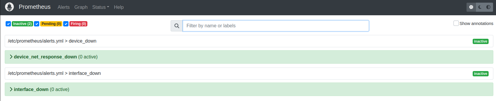
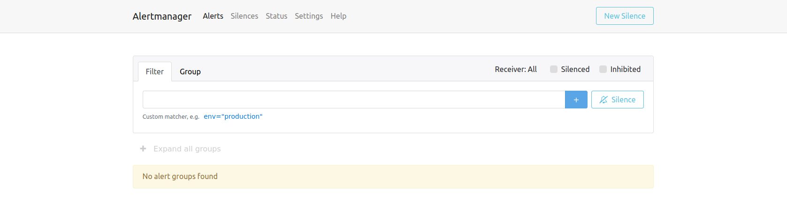
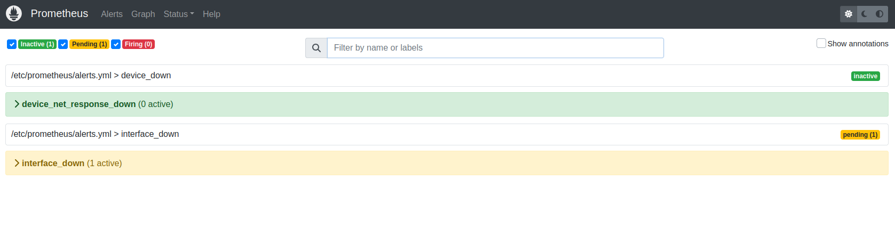
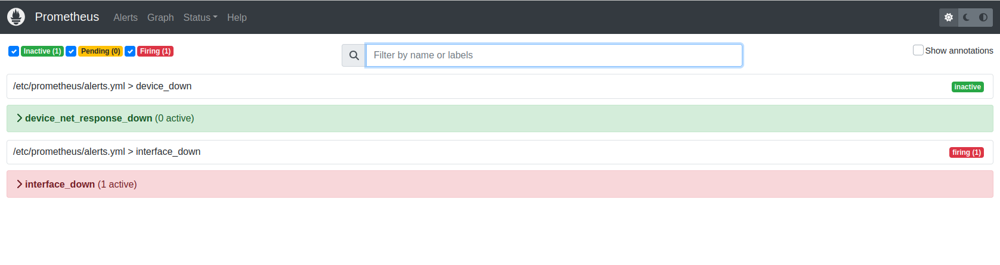
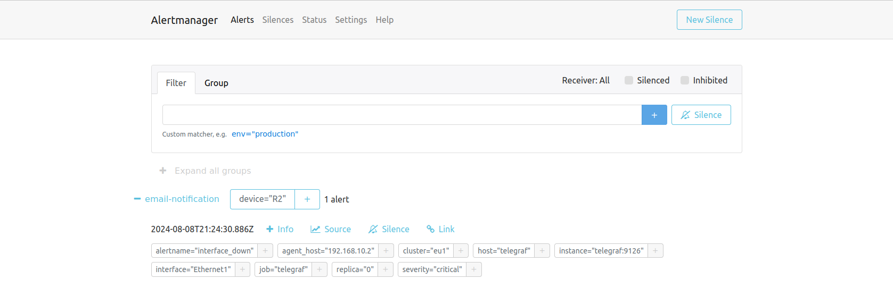

# Alertmanager

Details about alertmanager can be found in the official [documentation](https://prometheus.io/docs/alerting/latest/alertmanager/), but in short it handles Prometheus alerts by:
- deduplicating
- grouping
- routing them to the correct receiver integration such as email
- silencing
- inhibition

We have already seen how to gather metrics from devices using Telegraf and visualize it in Grafana. Now it's time to define Prometheus rules which trigger alarms. These alarms can be sent to Alertmanager and handled according to the configuration

Let's focus on two alarms, one related to device reachability problem and the second one related to interface down state.

## Telegraf

Telegraf config section for `R1` looks like this:

```
# R1 config
[[inputs.snmp]]
  agents = ["192.168.10.1:161"]

  version = 2
  community = "arista"

  [[inputs.snmp.field]]
    oid = "SNMP-FRAMEWORK-MIB::snmpEngineTime.0"
    name = "uptime"

  [[inputs.snmp.table]]
        name = "interface"

        [[inputs.snmp.table.field]]
            name = "interface"
            oid = "IF-MIB::ifDescr"
            is_tag = true

        [[inputs.snmp.table.field]]
            name = "speed_megabits"
            oid = "IF-MIB::ifHighSpeed"

        [[inputs.snmp.table.field]]
            name = "speed_bits"
            oid = "IF-MIB::ifSpeed"

        [[inputs.snmp.table.field]]
            name = "last_change"
            oid = "IF-MIB::ifLastChange"

        [[inputs.snmp.table.field]]
            name = "oper_status"
            oid = "IF-MIB::ifOperStatus"

        [[inputs.snmp.table.field]]
            name = "admin_status"
            oid = "IF-MIB::ifAdminStatus"

        [[inputs.snmp.table.field]]
            name = "in_errors_pkts"
            oid = "IF-MIB::ifInErrors"

        [[inputs.snmp.table.field]]
            name = "out_errors_pkts"
            oid = "IF-MIB::ifOutErrors"

        [[inputs.snmp.table.field]]
            name = "in_discards"
            oid = "IF-MIB::ifInDiscards"

        [[inputs.snmp.table.field]]
            name = "out_discards"
            oid = "IF-MIB::ifOutDiscards"

[[inputs.net_response]]
    protocol = "tcp"
    address = "192.168.10.1:22"

    [inputs.net_response.tags]
        device = "R1"
        device_role = "router"
        device_platform = "eos"
```
Using the Telegraf agent we collect information about interface state(up/down, errors, discards) but also info about device reachability(net_response).


## Prometheus

Prometheus config needs to be extended with additional information about the rules and Alertmanager:
```
<...>

alerting:
  alertmanagers:
    - scheme: http
      static_configs:
        - targets: [ 'alertmanager:9093' ]

rule_files:
  - /etc/prometheus/alerts.yml

```

`alertmanager:9093` is a container name and the port on the local system that Alertmanager receives alerts.

Let's take advantage of the metrics that we are now able to collect and define some rules that allow us to check device reachability and interface down state.

`alerts.yml` file:

```
---
groups:
  - name: device_down
    rules:
      - alert: device_net_response_down
        expr: net_response_result_code{job="telegraf", result_type!="success"} != 0
        for: 10s
        labels:
          severity: critical
        annotations:
          summary: "Device {{$labels.device}} not reachable through Telegraf net_response for more than 10 seconds"
  
  - name: interface_down
    rules:
      - alert: interface_down
        expr: interface_oper_status==2 and interface_admin_status==1
        for: 10s
        labels:
          severity: critical
        annotations:
          summary: "Interface {{$labels.interface}} oper state down for more than 10 seconds. Device {{$labels.device}}"
```
Alerts must be active for more than 10 seconds to transition into a firing state, which is when alerts are being sent to Alertmanager

## Alertmanager

Example configuration of Alertmanager to handle alerts received from Prometheus.

```
global:
  resolve_timeout: 1m

route:
  receiver: "email-notification"
  routes:
  - receiver: "email-notification"
    matchers:
    - alertname=~"device_down"
    group_by: [ device ]
    group_interval: 1m
    group_wait: 2m
    repeat_interval: 24h
  - receiver: "email-notification"
    matchers:
    - alertname=~"interface_down"
    group_by: [ device ]
    group_interval: 1m
    group_wait: 2m
    repeat_interval: 24h

receivers:
- name: "email-notification"
  email_configs:
  - to: <...>
    smarthost: <...>
    auth_username: <...>
    auth_password: <...>
    from: <...>
    send_resolved: true
    require_tls: false
    text: >-
      {{ range .Alerts -}}
      *Alert:* {{ .Annotations.title }}

      *Description:* {{ .Description.title }}

      *Details:*
        {{ range .Labels.SortedPairs }} - *{{ .Name }}:* `{{ .Value }}`
        {{ end }}
      {{ end }}
```

Alertmanager provides support for multiple receivers and email is one of them. Feel free to choose any other one that suits your environment(slack, teams,  pagerduty, discord etc.).

Prometheus alerts are grouped by `device` and it's 2 minutes before Alertmanager treats the alert as valid one and perform any action. Also any next similar Prometheus alert would not trigger any action for next 24h.

Full explanation of the available settings can be found in the official docs.

## Triggering alert

Let's try to simulate interface down alert scenario by shutting down one of the interfaces on R1. If it's connected to R2, then we should see a alert raised by Prometheus cause `ADMIN UP/OPER DOWN` state is defined in our case as a faulty state.

Before interface is shutdown, Prometheus Alerts section looks like this:



Alertmanager page is empty which means no alerts detected so far:



In the next step lets shutdown interface and see how information about faulty state is passed from Device(through Telegraf) -> Prometheus -> Alertmanager -> Email 


Prometheus alert in a pending state:



After 10 seconds since first notification alert transition into firing state:



Finally, the alert is visible in Alertmanager and after 2 minutes, the notification is sent to the receiver configured in the alertmanager `config.yml`.



# Conclusion

Alertmanager together with Prometheus is a great solution to monitor your network and notify operations teams about network issues in many different ways.
On top of Alertmanager receivers, alerts may be processed by scripts(i.e. lambda) and trigger additional workflows, like playbooks in AWX. 
